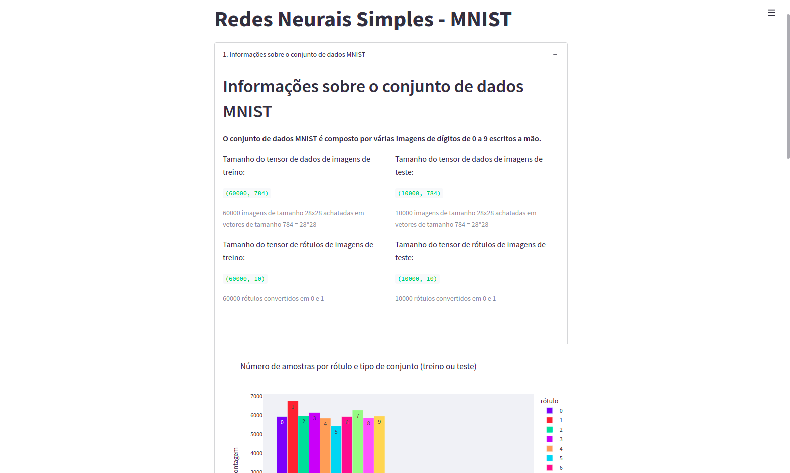
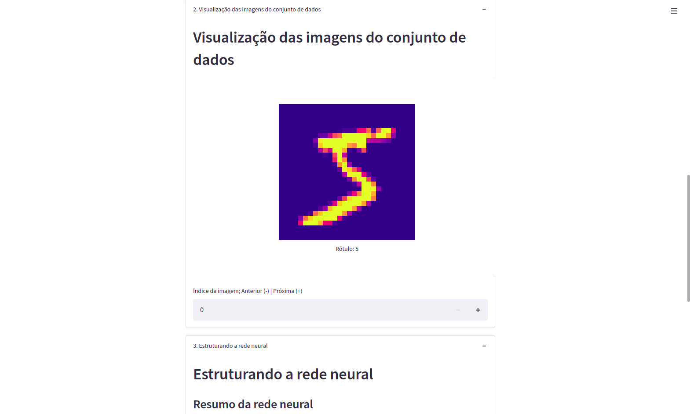
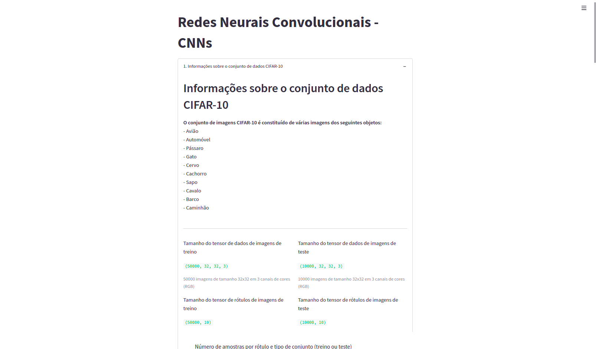
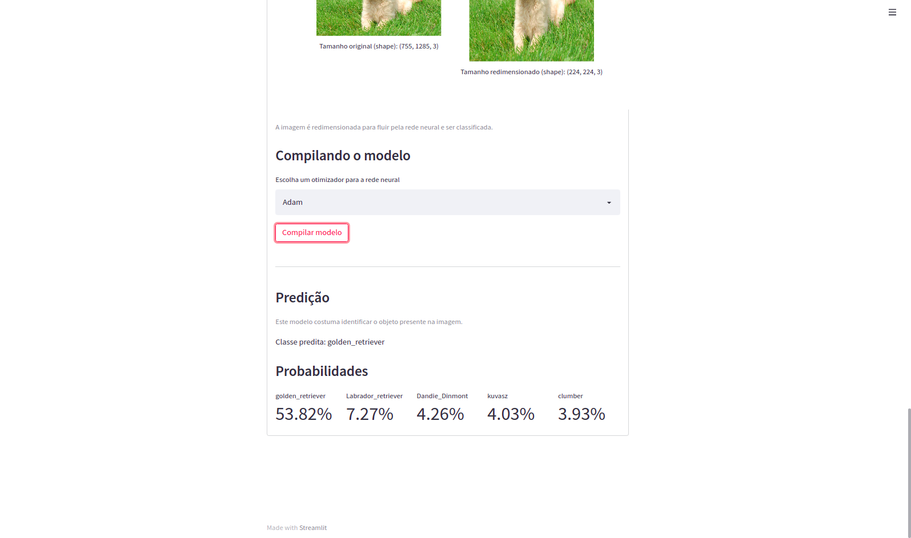
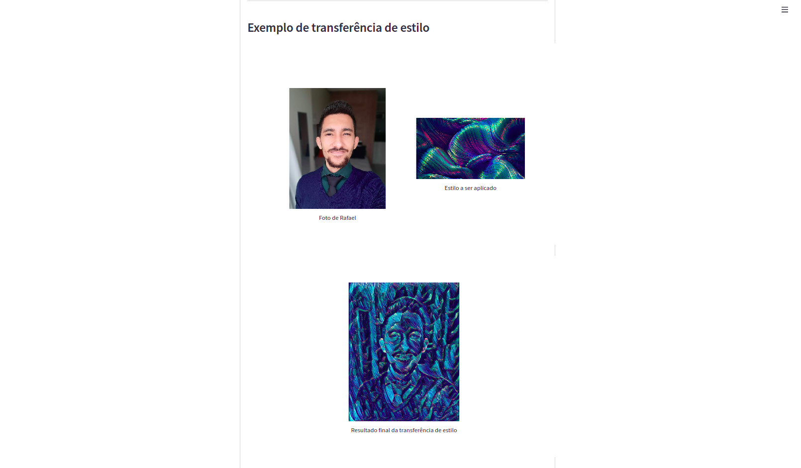

# Deep Learning using Tensorflow & Keras

## Objetivo
Basically, I transformed my deep learning studies review into a project which has a Streamlit web page format.

## Observations
1. In the moment I developed this repo, the initial project was a page application divided into four parts. But in that moment, Streamlit Cloud supported maximum 500MB data (including installed packages, downloaded datasets etc.). Due to it, I needed to partition the project into four different pages.
2. In the case you access some of these pages in a smartphone, use this on the landscape mode (horizontal) to images staying in the correct size.  

## Project links
https://share.streamlit.io/rafaelcoelho1409/deeplearning/app1.py (Simple Neural Networks - MNIST)
https://share.streamlit.io/rafaelcoelho1409/deeplearning/app2.py (Convolutional Neural Networks - CNNs)
https://share.streamlit.io/rafaelcoelho1409/deeplearning/app3.py (Predictions with pre-trained neural networks)
https://share.streamlit.io/rafaelcoelho1409/deeplearning/app4.py (Tensorflow Hub application)

## Resources
- Visual Studio Code
- python3.8
- virtualenv
- pip3: gerenciador de pacotes python3.x

## Python packages
- streamlit
- tensorflow
- tensorflow.keras
- pandas
- plotly
- sys
- time
- io
- PIL

## Approached topics in this project
- Simple Neural Networks - MNIST (app1.py)
- Convolutional Neural Networks - CNNs (app2.py)
- Predictions with pre-trained neural networks (app3.py)
- Tensorflow Hub applications (app4.py)

## Running this repo in your local machine
- clone this repo:  
> git clone https://github.com/rafaelcoelho1409/DeepLearning.git
- install required packages that are in 'requirements.txt' file:
> pip3 install -r requirements.txt
- choose your python interpreter (python3.x)  
- execute the following commands (for Linux):
> cd DeepLearning  
> streamlit run appX.py (change X for 1, 2, 3 or 4)  
- With these commands, the web page will opened automatically. In the case it doesn't open, go to the browser and type:
> http://localhost:8501  

## Screenshots

