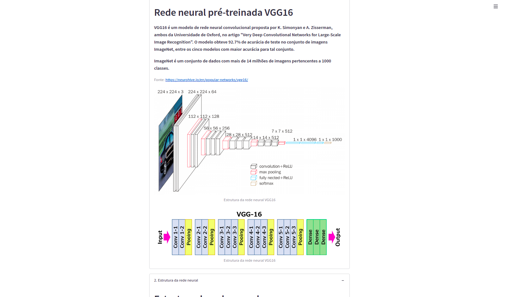
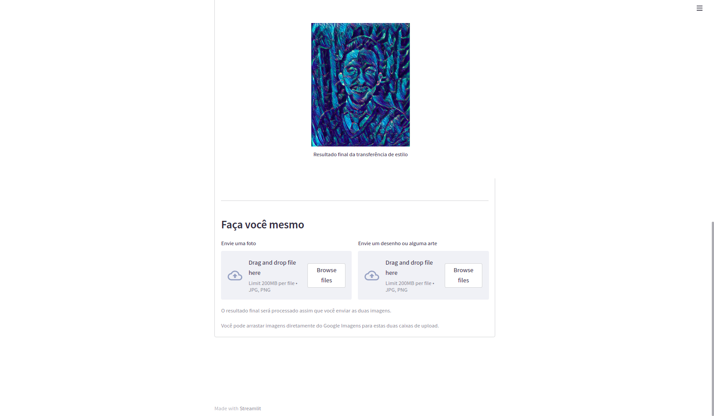

# Deep Learning usando Tensorflow & Keras

## Objetivo
Basicamente, transformei minha revisão de estudos de deep learning em um projeto, e estou disponibilizando em formato de site do Streamlit.

## Link deste projeto
A postar

## Recursos utilizados
- Visual Studio Code
- python3.8
- virtualenv
- pip3: gerenciador de pacotes python3.x

## Pacotes do Python
- streamlit
- tensorflow
- tensorflow.keras
- pandas
- plotly
- sys
- time
- io
- PIL

## Tópicos abordados neste projeto
- Redes Neurais Simples - MNIST
- Redes Neurais Convolucionais - CNNs
- Predições com redes neurais pré-treinadas
- Aplicação com Tensorflow Hub
- Código Python do projeto

## Para executar esse arquivo localmente em sua máquina
- baixe esse repositório em sua máquina:
> git clone https://github.com/rafaelcoelho1409/DeepLearning.git
- instale os pacotes necessários que estão no arquivo requirements.txt:
> pip3 install -r requirements.txt
- escolha seu interpretador python (python3, python3.x)  
- execute os seguintes comandos (para Linux):
> cd DeepLearning  
> streamlit run dl_streamlit.py  
- Com esses comandos, a página será aberta automaticamente. Caso não abra, vá até seu navegador e digite:
> http://localhost:8501  

## Screenshots da página construída

